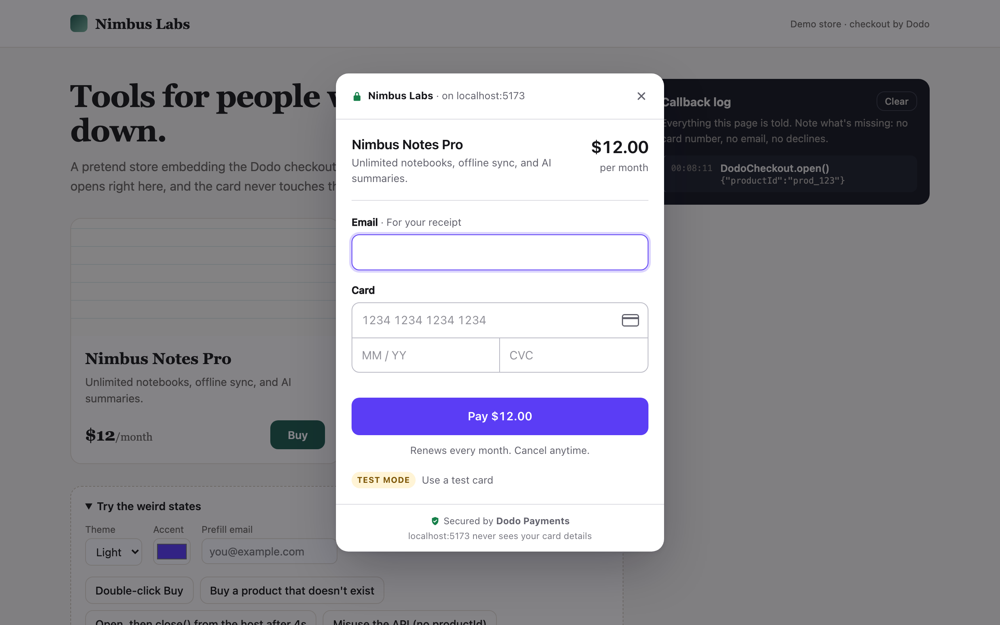

# Tiny Embeddable Checkout

A checkout any site can embed with one script tag and one function call. The card is typed into a frame the host page can't read, and the host always learns the outcome.

```html
<script src="https://CHECKOUT_ORIGIN/sdk/v1.js"></script>
<script>
  DodoCheckout.open({
    productId: "prod_123",
    onSuccess: ({ sessionId }) => {},
    onClose: ({ reason }) => {},
    onError: ({ code, message }) => {},
  });
</script>
```

**Live demo:** _add link after deploying_ · **Test cards:** `4242 4242 4242 4242` succeeds · `4000 0000 0000 0002` declines · `4000 0000 0000 0341` fails once, then succeeds on retry



## Run it

```bash
npm install
npm run dev          # demo store on :5173, checkout + SDK on :5174
npm test             # unit tests (card validation, fake processor)
npx playwright test  # end-to-end: every edge case below, in Chrome, Safari (WebKit), Firefox and iPhone Safari
npm run build        # production builds of all three pieces
```

Open http://localhost:5173. The two apps run on different ports on purpose. Different ports are different origins, which is the security boundary this whole design depends on.

## The three pieces

| Piece | Where | What it is |
|---|---|---|
| SDK | `packages/sdk` | One dependency-free TypeScript file, bundled to `sdk/v1.js` (~3 KB gzipped). It's **served by the checkout origin**, the way Stripe.js is served from js.stripe.com, so it always matches the checkout it talks to. |
| Checkout app | `apps/checkout` | React + TypeScript. Product lookup, card form, fake processor, every state. Runs inside an iframe. |
| Demo store | `apps/demo` | A pretend merchant ("Nimbus Labs") with Buy buttons, a live **callback log**, and a panel of buttons that trigger each weird state on purpose. |

## How the pieces talk

```
Host page (store.com)                          Checkout iframe (checkout origin)
─────────────────────                          ─────────────────────────────────
DodoCheckout.open(opts)
  ├─ validate opts (throws on misuse)
  ├─ lock scroll, remember focus
  ├─ <iframe src="CHECKOUT_ORIGIN/?embed=1">
  │                                             bridge listens before React renders
  ├─ on iframe load:
  │   postMessage(init, CHECKOUT_ORIGIN, [port]) ─►  accept only from window.parent,
  │                                                  only once; keep the MessagePort
  │   ◄──────────────────────────── port: ready   (host fades spinner → checkout)
  │                                                  customer types card here only
  │   ◄──────────────────── port: success{sessionId}   (the moment it's paid)
  │   ◄──────────────────── port: error{code,message}  (integration problems only)
  │   port: close_request ─────────────────────────►  (host called handle.close())
  │   ◄──────────────────── port: close{reason}
  └─ onClose (always last, exactly once) → restore scroll + focus
```

- **One `postMessage`, then a private channel.** The init message goes to the checkout origin only (`targetOrigin` is pinned) and carries a `MessagePort`. After that, everything goes over the port. Other scripts or frames on the page can't listen in or inject events.
- **Everything crossing is validated.** Both sides parse messages into typed events (`packages/sdk/src/protocol.ts`) and drop anything that doesn't match.
- **What crosses the line:** product id, prefill email and appearance (host → checkout); `ready`, `success{sessionId}`, `error{code,message}` and `close{reason}` (checkout → host).
- **What never crosses:** card number, expiry, CVC, the email the customer typed, and card declines.
- **The price is never taken from the host.** The checkout looks the product up itself, so a tampered host page can't change the amount.

## Guarantees the host can rely on

- `onClose` fires **exactly once** per `open()`, **always last**.
- `onSuccess` fires **at most once**, **as soon as the payment succeeds**. It doesn't wait for the customer to click Done, because they might just close the tab.
- `onError` fires at most once, for problems the integration has to know about: `product_not_found`, `checkout_unavailable` (didn't load within 10s), `version_mismatch`.
- `open()` while a checkout is already open **returns the same handle** and opens nothing new. Double-clicking Buy gives one checkout and one `onClose`.
- `handle.close()` during a payment **waits for the payment to settle**, so the host still gets `onSuccess` if it went through.
- Misuse throws immediately and clearly (`productId` missing, callback not a function, bad color). That's a developer error, and it should surface during development, not show up later as a runtime failure.
- A host callback that throws is caught and logged. It can't wedge the checkout.

## Choices I made (and why)

**Who you're paying, on which site, is always visible.** The top bar reads "🔒 Nimbus Labs · on store.com". The site name comes from the browser's own record of the embedding page's origin, not from anything the host sends. Most embedded checkouts don't say where they're running, which makes a lookalike easy to build.

**The host gets two design knobs: theme and one accent color.** No CSS, fonts, copy or layout. If any page could restyle the checkout, any page could make it look like something else. The amount, the merchant and the security line should look the same everywhere. The accent only touches the Pay button and focus rings, and the button's text color flips to black or white automatically to stay readable.

**Fewer fields.** Email, card, expiry, CVC. No name on card, no billing address, no country: a card payment doesn't need them here. Number, expiry and CVC sit in one box shaped like a card. Focus jumps forward only when the number is complete **and** passes the checksum, and Backspace on an empty field steps back.

**Every error says whether money moved.** "Your card was declined. You haven't been charged — try a different card." "We couldn't reach your bank. You haven't been charged." That's the first thing someone wonders after a failed payment.

**The Pay button shows the exact amount.** "Pay $12.00", not "Submit". Subscriptions say "Renews every month. Cancel anytime." under the button.

**You can't close mid-payment.** Esc, the backdrop and × are held while "Processing…" shows (× explains why), so nobody closes the window without knowing whether they paid.

**Test mode is explicit.** A "Test mode" pill opens the three test cards, and clicking one fills it in. A real card number gets a clear "this is test mode" message instead of a fake success.

## Weird states

| Situation | What happens |
|---|---|
| Buy clicked twice | One checkout. Second `open()` ignored with a console warning. |
| Enter + click, or Retry spammed | One charge in flight at a time. A session that's already paid never charges again (idempotency on the session id). |
| Card declined | Stays inside the checkout. Banner, and the card number is focused and selected so the customer can retype it. Host hears nothing until close. |
| Bank unreachable (`…0341`) | "Try again" gets focus. Retrying reuses the same session, so it can't double charge. |
| Offline | Banner, Pay disabled, recovers by itself when the connection returns. |
| Unknown product | `onError(product_not_found)`, a plain "This item isn't available — nothing was charged", then `onClose(error)`. |
| Checkout host down / blocked | After 10s: `onError(checkout_unavailable)`, and the SDK shows its own "Checkout couldn't load" card (not a spinner forever), with focus on Close. |
| Host calls `close()` mid-payment | Close waits for the result; `onSuccess` still fires. |
| Host callback throws | Caught and logged; checkout keeps working. |
| Opened directly, not in an iframe | A short explanation of how to embed it, instead of a broken form. |

## Tested in

11 end-to-end scenarios × 4 browsers (Chromium, WebKit/Safari, Firefox, iPhone 13 Safari) = 44 passing runs, plus unit tests for card validation and the fake processor.

**One Safari-specific behavior worth knowing:** Safari doesn't let a cross-origin iframe move keyboard focus by itself until the customer interacts with it. So when the checkout opens there, focus can't be forced into the email field, and after an async decline it can't be forced back onto the card. Rather than fight that, the checkout **defers the move to the customer's next keystroke**: the first key typed lands in the email field, and after a decline the next key goes to the card number, with the old number selected so typing replaces it. No keystroke is lost. Chrome and Firefox get the focus moves immediately. (Also: Safari on macOS doesn't focus a button when you click it, so "return focus to the Buy button" only applies to keyboard users there.)

## Craft details

- The dialog is a real modal: focus trap, Esc, focus returned to the Buy button on close, page scroll locked (with scrollbar-width compensation so the page doesn't jump).
- Field errors appear when you leave a field you've filled in, or when you press Pay — never while typing, and never just for tabbing past an empty field.
- While paying, fields go read-only rather than disabled, so keyboard focus stays where the customer left it. They're linked with `aria-describedby`/`aria-invalid`; banners use `role="alert"`.
- Correct `autocomplete` values (`email`, `cc-number`, `cc-exp`, `cc-csc`) and `inputmode="numeric"`, so autofill and mobile keyboards work.
- A bottom sheet on phones, with the Pay button within thumb reach.
- Motion is short (≤220ms) and turns off under `prefers-reduced-motion`.
- `onClose` never waits for the exit animation: the host is told first, then the SDK fades the frame.
- The checkout ships strict security headers (`vercel.json`): CSP with `form-action 'none'`, `no-referrer`, `nosniff`.

## Two decisions I went back and forth on

**1. When should the merchant hear about a successful payment?**
Firing `onSuccess` on close is simpler for the host: one moment, one "we're done" callback. But the customer might never close. They might see the receipt and shut the tab, and the merchant would never provision what they paid for. So `onSuccess` fires the instant the payment succeeds, and `onClose` follows later with `reason: "completed"`. The cost is that a merchant can't treat `onSuccess` as "the modal is gone". The README and the type docs say so explicitly. (In production, the real source of truth would be a server webhook. Client callbacks are for the UI.)

**2. How much should the host page know about failures?**
The obvious reading of "the host page always finds out the truth" is to send every decline to `onError`. I weighed that against keeping declines inside the checkout, and the question became what "the truth" actually is. A decline isn't an outcome: the customer is still in the checkout and can fix it with another card. Telling the host page about each decline leaks details about someone's card to a page that doesn't need them, and invites merchants to build their own error UI on top of ours. So the host learns **outcomes** (paid, closed, broken integration), not every attempt. `onError` is reserved for things the merchant must act on (`product_not_found`, `checkout_unavailable`, `version_mismatch`), and card problems stay between the customer and the checkout.

(Smaller one: a closed shadow root for the SDK's loading overlay. I went with open. The isolation that protects card data is the cross-origin iframe, and a closed root would only hide the overlay from the merchant's own devtools and tests.)

## What I'd explore next

- **Server-created sessions.** Today the host passes a `productId`. In production the merchant's backend would create a checkout session (price, customer, metadata) and pass only its id to `open()`. That removes client-side product lookup entirely and makes the session id meaningful to both sides.
- **Webhooks as the source of truth**, with callbacks kept for UI only, plus a `DodoCheckout.retrieve(sessionId)`-style reconciliation for when the page reloads mid-flow.
- **Per-merchant `frame-ancestors`** so the checkout only renders on domains the merchant registered, plus a verified-domain badge in the top bar.
- **3-D Secure challenges** inside the same frame, and wallets (Apple Pay / Google Pay) above the card form.
- **Localization and currencies** (the formatting is already `Intl`-based), and tax lines when the merchant of record adds them.
- **Subresource Integrity** for `sdk/v1.js`, and versioned, immutable SDK URLs.
- **Visual regression tests** for the states in `docs/`, and axe checks in the e2e suite.

## Project layout

```
packages/sdk/src/index.ts      SDK: open(), iframe, handshake, overlay, guarantees
packages/sdk/src/protocol.ts   message types + validators shared by both sides
apps/checkout/src/lib/         bridge, card validation, fake processor, catalog, focus trap
apps/checkout/src/components/  Shell, PaymentForm, SuccessView, BrandMark
apps/demo/                     the pretend store + callback log + weird-state buttons
e2e/checkout.spec.ts           end-to-end tests for every row in the table above (4 browsers)
docs/                          screenshots of each state
```

## Deploying

The checkout and the demo must be on **different origins**, which here means two deployments:

1. Deploy `apps/checkout` (build: `npm run build:sdk && npm -w apps/checkout run build`, output `apps/checkout/dist`). Its `vercel.json` sets the security headers.
2. Deploy `apps/demo` with `VITE_CHECKOUT_ORIGIN=https://<checkout-deployment>` (build: `npm -w apps/demo run build`, output `apps/demo/dist`).
